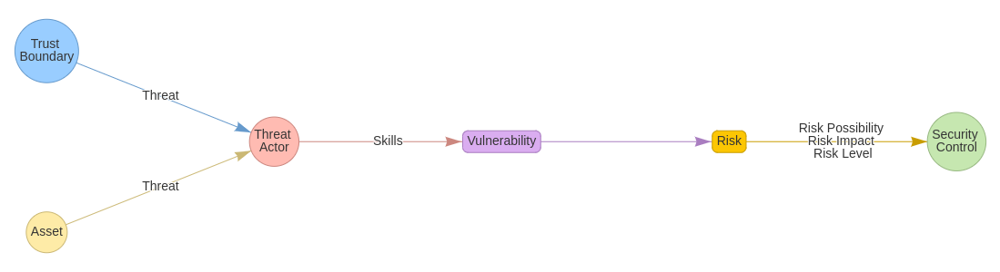
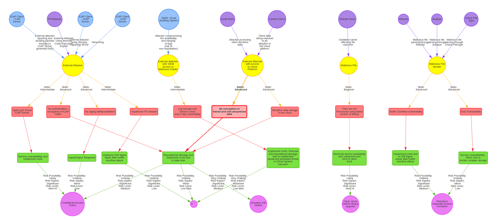
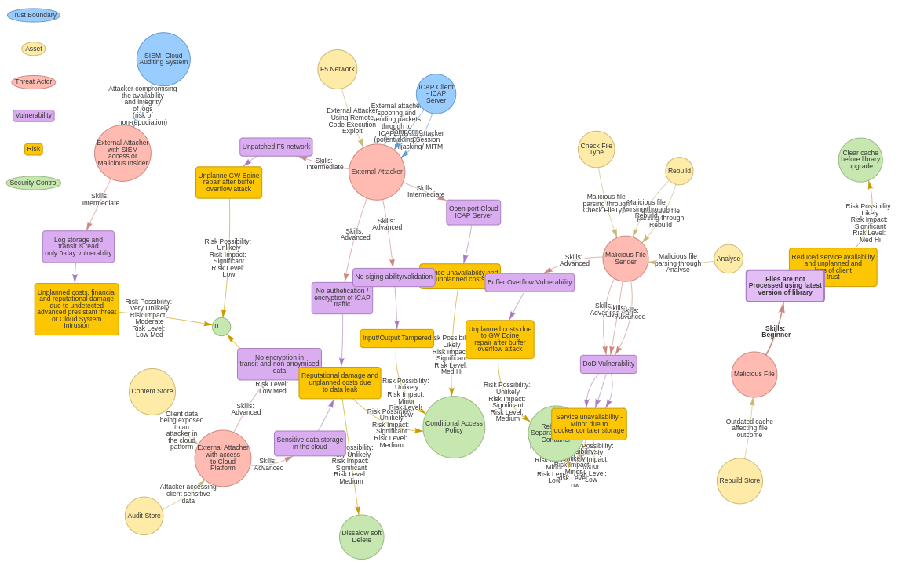

## Steps to use Visjs in jupyter-notebook:

1. Install Anaconda

2. Download [vis.ja](https://github.com/almende/vis/archive/v4.19.1.zip) and unzip it in the desired location

3. Add the following line to *.jupyter/jupyter_notebook_config.py*

```
    c.NotebookApp.extra_static_paths = ["/home/lucia/vis-4.19.1/dist"]
```

Replace the path with the path to the folder where you unziped vis.ja,

dist is the location of the distribution folder of vis.js libraries

4. Next time you start jupyter-notebook it should work

Further details in this
[article](https://www.codementor.io/@isaib.cicourel/visjs-visualization-in-jupyter-notebook-phgb3fjv0)

## How to use the "Threat Model Network Visualisation" notebook

This notebook will pull data from this [google spread sheet](https://docs.google.com/spreadsheets/d/1BouPWCBx9rD8ORVC3GoStxGleOwDr9vg-uql-_DG66M/edit#gid=0)
in order to create two visualization networks of the Threat Model: one with a Hierarchy, and another one with No Hierarchy.

The pulled data can be edited inside the notebook and changes will be saved to an excel file in the data folder. This changes will be reflected in the networks.

Json files with the nodes and edges data are created for each network, these files can be found in the data folder.

The networks can be visualized inside the notebook and also with the html pages that you can find in this folder.

To be able to visualize the html pages you will need to run a local server.

If you are using **Ubuntu**, to start the http server on an specific port, for instance port 8080, simply type:

```
	python -m http.server 8080
```

Below are some examples on what networks looks like.

### Workflow



### With Hierarchy



### No Hierarchy


